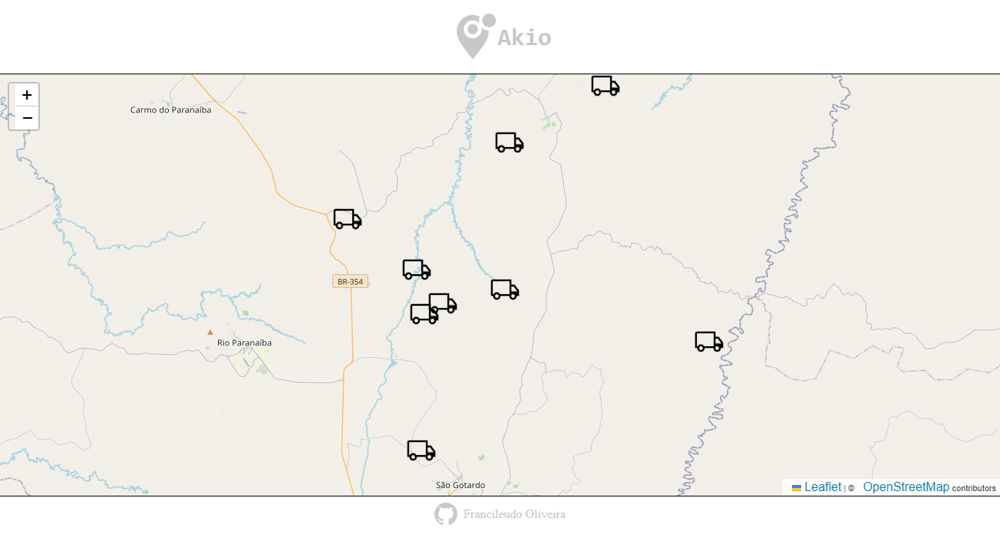

<div align='center' id='top'>


&#xa0;

</div>

<h1 align='center'>AIKO MAP</h1>

<p align='center'>


<br>

## :dart: Sobre ##

O projeto trata-se de um desafio de código para um processo seletivo da empresa Aiko, onde a missão seria o desenvolvimento de uma aplicação que de uma empresa que coleta dados de equipamentos utilizados em uma operação florestal. Dentre esses dados estão o histórico de posições e estados desses equipamentos. O estado de um equipamento é utilizado para saber o que o equipamento estava fazendo em um determinado momento, seja *Operando*, *Parado* ou em *Manutenção*. O estado é alterado de acordo com o uso do equipamento na operação, já a posição do equipamento é coletada através do GPS e é enviada e armazenada de tempo em tempo pela aplicação.

O objetivo foi, de posse desses dados, desenvolver o frontend de aplicação web que trate e exibida essas informações para os gestores da operação.

## :sparkles: Requisitos Obrigatórios ##

:heavy_check_mark: **Posições dos equipamentos**: Exibir no mapa os equipamentos nas suas posições mais recentes.;

:heavy_check_mark: **Estado atual do equipamento**: Visualizar o estado mais recente dos equipamentos. Exemplo: mostrando no mapa, como um pop-up, mouse hover sobre o equipamento, etc.;

:heavy_check_mark: **Histórico de estados do equipamento**: Permitir a visualização do histórico de estados de um equipamento específico ao clicar sobre o equipamento.;

## :rocket: Tecnologias ##

As seguintes ferramentas foram usadas na construção do projeto:

<p align='center'>


</p>

## :white_check_mark: Pré requisitos ##

Antes de começar :checkered_flag:, você precisa ter o [Git](https://git-scm.com) e o [Node](https://nodejs.org/en/) instalados em sua maquina.

## :checkered_flag: Começando ##

```bash
# Clone este repositório
$ git clone https://github.com/fransilva0/teste-frontend-estagio-v2

# Entre na pasta
$ cd teste-frontend-estagio-v2

# Instale as dependências
$ yarn

# Para iniciar o projeto
$ yarn start

# O app vai inicializar em <http://localhost:3000>
```

## :technologist: Sobre o Código ##

O código foi construído em ReactJs, onde a pasta **public** guarda o arquivo **index.html**, onde se encontram o link da folha de estilo do **leaflet**, responsável pela visualização do mapa.

A pasta **src** guarda os demais códigos, sendo a primeira pasta dentro dele o **assets**, responsável por armazenar os arquivos **JSON** disponibilizados pela AIKO para o desafio, todos armazenados na pasta **data**; a pasta **data-acess**, guardando o arquivo javascript responsável por acessar os dados dos arquivos de **data**; a última pasta do **assets** é o **img**, que guarda o icone usado no projeto.

No arquivo **index.js** presente dentro da pasta **data-acess**, se encontra as funções descritas a seguir:

- **getEquipmentName()** = esta função retorna os nomes do equipamento atraves do ID, retornando o nome em String.

- **getEquipmentModel()** = esta função retorna o modelo do equipamento atraves do ID, retornndo o modelo em String.

- **getEquipmentCurrentState()** = esta função, por meio do ID do equipamento, pega todo o estado do equipamento, do primeiro ao último, após isso ele reverte o novo array de estados e retorna o nome do último estado do equipamento, que se encontra na posição 0 do novo array.

- **getStateColorNameById()** = esta afunção por meio do ID do equipamento, retorna uma string com uma etiqueta (nome da cor em string)para ser usada no CSS do componente **EquipamentHistoryCard** apresentando a cor do estado para o usuário.

- **getStateNameById()** = esta função pega o nome do estado atraves do Id do equipamento

- **getStateHistoryByEquipmentId()** = esta função, por meio do ID do equipamento, pega todos os estados de um equipamento e coloca em um novo array de forma revertida (começando da última posição, a mais recente) e retorna esse array.


Saindo da pasta **assets**, temos a pasta **components**, cuja responsabilidade é de armazenar os componentes construídos no projeto, sendo eles, mensionados a seguir:

- **Nav** = componente responsável pela navbar da aplicação, esse componente tem outro componente reponsável por pegar um icone do Iconify, sendo esse componente do mesmo.

- **Footer** = componente reponsável pelo rodapé da aplicação, esse componente possui um icone do Iconify, assim como o componente acima.

- **Map** = componente que utiliza o *leaflet* para apresentar o mapa na tela inicial, este componente chama dois componomentes do *react-leaflet*, além do css do *leaflet* para modificar o tamanho da janela em que o mapa aparece. O componente também chama outro componente, o *MapsMarking*.

- **MapsMarking** = o componente apresenta uma função que reverte o
  histórico de posições dos equipamentos, pega o ID de cada equipamento
  presente para identificação de cada array de histórico de posições
  que será usado como parametro nas funções *getEquipmentName*,
  *getEquipmentModel* e *getEquipmentCurrentState* do **data-acess**.
  O componente utiliza os componentes do *react-leaflet* (*marker* e
  *popup*) para mostrar os equipamentos em suas posições mais recentes
  (que estão no histórico de posições do equipamento) no mapa,
  adicionando também um componente *Link* do *react-router-dom*, dentro
  do *popup*, para levar o usuario para a tela de histórico de estados
  do equipamento (levando também, pelo link, o ID do equipamento)

- **StatesHistory** = o componente pega o ID do quipamento, que foi
  passando pelo *MapsMarking*, atráves do *Link* do *react-router-dom*
  e passa para o componente *EquipmentHistoryCard*.

- **EquipmentHistoryCard** = o componente recebe o ID do equipamento
  passado pelo *StatesHistory* e coloca esse ID como atributo para a
  função *getStateHistoryByEquipmentId()*, recebendo o array de estados
  do equipamento como retorno. Com o array, basta percorrer com o .map
  () e retorna um cartão com a data, hora e o estado neste momento, com
  a cor sendo enviada para o css por meio de propriedades.

Saindo da pasta de **components** tem-se mais três arquivos de código:
*APP.js*, *globalCSS.js* e *index.js*, sendo:

- **index.js** = responsável por pedir para o *React Dom* renderizar os
  components dentro da div com o ID *root* no html.

- **globalCSS** = responsável pelo CSS global do código, *reset*.

- **App.js** = responsável pelas rotas da aplicação (uma apresenta o
  mapa, e a outra o histórico de estados de um equipamento).

## :sparkles: Requisitos Interesantes para Serem Adicionados no Futuro ##

- [ ] Filtros: Filtrar as visualizações por estado atual ou modelo de
  equipamento.

- [ ] Pesquisa: Ser possível pesquisar por dados de um equipamento
  especifico.

- [ ] Percentual de Produtividade do equipamento: Calcular a
  produtividade do equipamento, que consiste em uma relação das horas produtivas (em estado "Operando") em relação ao total de horas. Exemplo se um equipamento teve 18 horas operando no dia a formula deve ser 18 / 24 * 100 = 75% de produtividade.

- [ ] Ganho por equipamento: Calcular o ganho do equipamento com base
  no valor recebido por hora informado no Modelo de Equipamento. Exemplo se um modelo de equipamento gera 100 por hora em operando e -20 em manutenção, então se esse equipamento ficou 10 horas em operação e 4 em manutenção ele gerou 10 * 100 + 4 * -20 = 920.

- [ ] Diferenciar os equipamentos: Diferenciar visualmente os
  equipamentos por modelo de equipamento na visualização do mapa.

- [ ] Histórico de posições: Que seja possível visualizar o histórico
  de posições de um equipamento, mostrando o trajeto realizado por ele.

- [ ] Testes: Desenvolva testes que achar necessário para a aplicação,
  seja testes unitários, testes automatizados, testes de
  acessibilidade, etc.

<br>
<br>

Feito com :heart: por <a href='https://github.com/fransilva0' target='_blank'>Francileudo Oliveira</a>

&#xa0;

<a href='#top'>Voltar para o topo</a>
