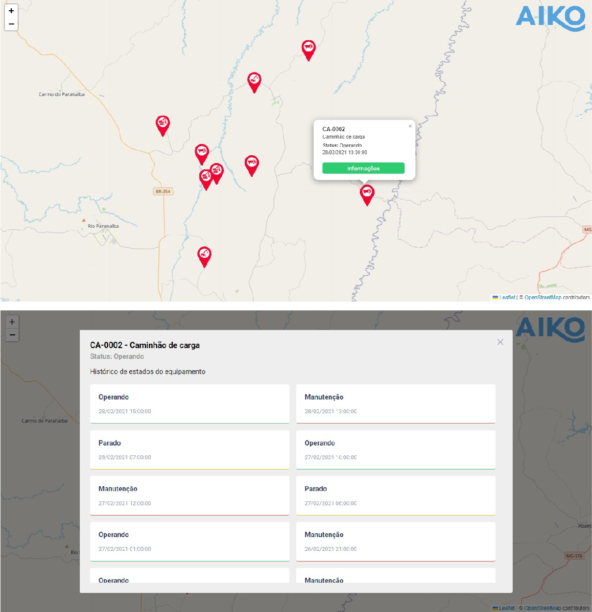

<div align="center">
    
  <h1>Equipment Manager</h1>
</div>
<p align="center">🚀 Aiko Frontend Challenge</p>
<p align="center">
  
  
  
  
</p>

<div align="center">
 <a href="#-objective">objective</a> •
 <a href="#-roadmap">roadmap</a> •
 <a href="#-technologies">technologies</a> •
 <a href="#-author">author</a>
</div>

---
</br>
<p align="center">
  
</p>


## 💡 Objective
<p>The main objective of this project is to collect data from equipment used in a forestry operation.</p>
<p>Basically, a list of equipment is displayed on the map which can be interacted with through a modal. It is possible to:</p>

- Show equipment on the map
- Show equipment status information
- Show equipment status history

> [Check Online](https://shiny-melomakarona-de4768.netlify.app/)


## 🎌 Roadmap

### Prerequisites
Before starting, you will need to have the following tools installed on your machine:
<ul>
  <li><a href="https://nodejs.org/en/">Node</a></li>
</ul>

You can also use npm, but we seriously recommend yarn.

Also it's nice to have an editor to work with the code like [VSCode](https://code.visualstudio.com/).

### Running the server

**Execute the commands**

```bash
# Clone this repository
$ git clone https://github.com/mathmelo/teste-frontend-estagio-v2 

# Access the project folder in the terminal/cmd
$ cd teste-frontend-estagio-v2

# Change branch to matheus-melo-da-costa
$ git checkout matheus-melo-da-costa

# Install dependencies
$ yarn

# Run server
$ yarn start

# The server will start on port:3000 - go to <http://localhost:3000>
```

## 💜 Technologies
- Typescript
- ReactJS
- React Context API
- Leaflet and React Leaflet (Leaflet integration with React)
- Styled Components
- React Modal and React-Perfect-ScrollBar (Custom components)

## Components
```javascript
  Map: {
    Info: 'Show the map on screen'
    use: {
      import { Map } from '[path]'

      function MyFunction() {
        return <Map equipments={Arr} openEquipmentInfoModal={func}/>
      }
    }
    props: {
      equipments: 'Array with all equipments'
      openEquipmentInfoModal: 'function to open modal'
    }
  }
```
```javascript
  EquipmentInfoModal: {
    Info: 'Opens a modal with the equipment information and  state history'
    use: {
      import EquipmentInfoModal from '[path]'

      function MyFunction() {
        return (
          <EquipmentInfoModal
            isOpen={Bool} 
            onRequestClose={Func}
          >
        )
      }
    }
    props: {
      isOpen: 'Open or close modal'
      onRequestClose: 'function to close modal'
    }
  }
```
## Hooks
```javascript
  equipments: {
    Info: 'Get equipment data'
    use: {
      import { useEquipments } from '[path]'

      function MyFunction() {
        const { equipments } = useEquipments()
        // return ...
      }
    }
  }
```
```javascript
  setEquipmentForModalData: {
    Info: 'Set data for use in modal'
    use: {
      import { setEquipmentForModalData } from '[path]'

      function MyFunction() {
        const { setEquipmentForModalData } = useEquipments();

        // equipment...
        setEquipmentForModalData(equipment)
        // return ...
      }
    }
  }
```
```javascript
  equipmentForModalData: {
    Info: 'Get equipment data for use in the modal'
    use: {
      import { equipmentForModalData } from '[path]'

      function MyFunction() {
        const { equipmentForModalData } = useEquipments();

        const data = equipmentForModalData();
        // return ...
      }
    }
  }
```

## 🤓 Author

Informations about [me](https://github.com/mathmelo).
Send me a message! ;)
