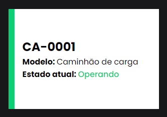
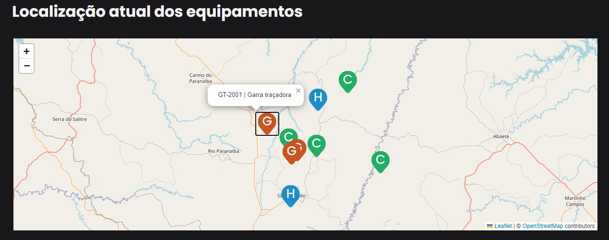
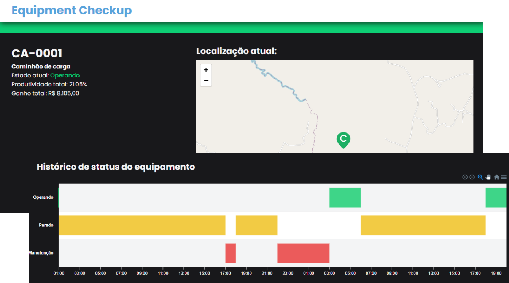

# Equipment Checkup

This is an application of a blog with paid content. If you do not have a paid subscription, only the beginning of the post will be visible.

This project was made on the Ignite React track, a Rocketseat course.

## Features

### Equipments cards

The equipments cards components in home page show some infos from each equipment. These infos are name, model and current state.

To facilitate the visibility current state of equipment, each card have a colered bar in her left with corresponding color of state.

### Current location of all equipments

A map using Leaflet wich display each equipment with differents marker for each model: G to "Garra traçadora", C to "Caminhão de carga" and H to "Harvester".

You can click on marker to see wich equipment is that.

### Detail page

Clicking in equipment card you go to this equipment details.

In this page you finds extras information about that equipment, like total productivity, total earning, current location in map and a chart with state history.

## Stacks

**Front-end:** React, NextJs, Typescript, Context API, Axios, SASS, Leaflet and Apexcharts

## Author

- Github: [@matheustsdev](https://github.com/matheustsdev)
- Linkedin: [Matheus Teixeira](https://www.linkedin.com/in/matheust0105/)
