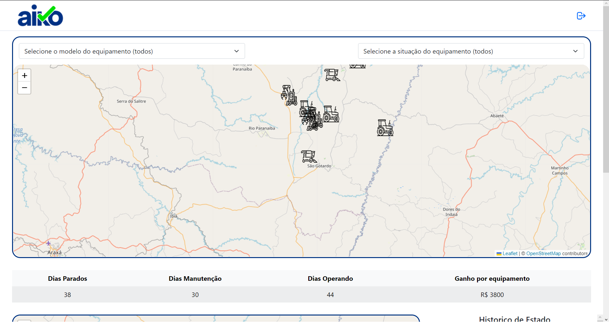

<div align="center" style="margin-bottom: 20px;">

</div>

<div align="center" style="margin: 20px;">
    <p align="center" >
      <a href="#fire-prévia-da-aplicação"> :fire: Prévia da Aplicação</a> |
      <a href="#rocket-tecnologias-usadas"> :rocket: Tecnologias Usadas</a> |
      <a href="#zap-executando-o-projeto"> :zap: Executando o Projeto </a> |
      <a href="#open_book-codigo"> :open_book: Código </a>
    </p>

</div>

## :barber: O projeto

O AIM é o resultado do desáfio proposto pela Aiko Digital de criar uma aplicação onde é possível localizar no mapa equipamentos e informações importantes como: modelo, nome do equipamento, estado de funcionamento e outros.

## :fire: Prévia da Aplicação

<div align="center">

</div>

### :rocket: Tecnologias Usadas

O projeto foi feito com as seguintes tecnologias:

- [ReactJS](https://pt-br.reactjs.org/)
- [Vite](https://vitejs.dev)
- [Styled-Components](https://styled-components.com/)
- [React-Redux](https://react-redux.js.org)
- [React-Bootstrap](https://react-bootstrap.github.io)
- [Leaflet](https://react-leaflet.js.org)
- {...}

## :zap: Executando o Projeto
#### Clonando o projeto
```sh
$ git clone git@github.com:orloke/teste-frontend-estagio-v2.git
$ cd teste-frontend-estagio-v2
```

#### Iniciando o projeto
```sh
$ npm install
$ npm run dev
```
