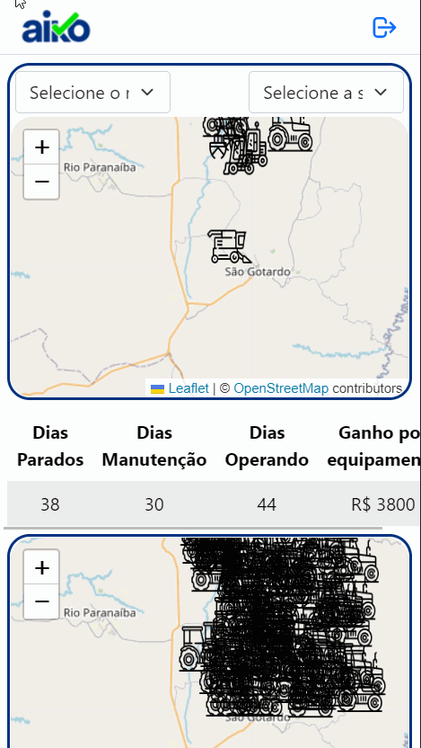

<div align="center" style="margin-bottom: 20px;">

</div>

<div align="center" style="margin: 20px;">
    <p align="center" >
      <a href="#fire-prévia-da-aplicação"> :fire: Prévia da Aplicação</a> |
      <a href="#rocket-tecnologias-usadas"> :rocket: Tecnologias Usadas</a> |
      <a href="#zap-executando-o-projeto"> :zap: Executando o Projeto </a> |
      <a href="#open_book-código"> :open_book: Código </a> |
      <a href="#grinning-conclusão"> :grinning: Conclusão </a> |
      <a href="#phone-contatos"> :phone: Contatos </a>
    </p>

</div>

## :barber: O projeto

O AIM - Aiko Info Map é o resultado do desáfio proposto pela Aiko Digital de criar uma aplicação onde é possível localizar no mapa equipamentos e informações importantes como: modelo, nome do equipamento, estado de funcionamento e outros.

## :fire: Prévia da Aplicação

<div align="center">

</div>

## :rocket: Tecnologias Usadas

O projeto foi feito com as seguintes tecnologias:

- [ReactJS](https://pt-br.reactjs.org/)
- [Vite](https://vitejs.dev)
- [Styled-Components](https://styled-components.com/)
- [React-Redux](https://react-redux.js.org)
- [React-Bootstrap](https://react-bootstrap.github.io)
- [Leaflet](https://react-leaflet.js.org)
- {...}

## :zap: Executando o Projeto
#### Clonando o projeto
```sh
$ git clone git@github.com:orloke/teste-frontend-estagio-v2.git
$ cd teste-frontend-estagio-v2
```

#### Iniciando o projeto
```sh
$ npm install
$ npm run dev
```

#### Pagina Inicial

Na pagina incial do projeto temos as seguintes informações:

* Logo da Aiko

Ao clicar no logo o usuário é redirecionado para a pagina inicial da empresa.

* Botão de Logout

Como a página tem informações que são particulares, acredito que para acessar será necessario fazer algum tipo de login. Logo tem que ter um botão de sair! Nesse caso o botão apenas envia para a pagina inicial da Aiko, já que a função de login ainda não existe.

* Mapa de todos os equipamentos

Nessse é possível filtrar os equipamentos por modelo e por situação atual.

* Tabela de informações

Na tabela logo abaixo do primeiro mapa, estão as informações do equipamento clicado, para ver outro equipamento basta clica-lo.

* Mapa de histórico de posições

Esse mostra todas as posições em que o equipamento selecionado esteve (para selecionar outro, basta clica-lo no mapa acima).

* Tabela de histórico de posições

Na tabela ao lado do segundo mapa, é exibido as informações dos estados do equipamento ao longo do tempo.

## :open_book: Código 

Na construção da aplicação, tentei dividir as responsabilidades entre os arquivos de modo a facilitar o entendimento e manutenção: as funções usadas estão em um arquivo, os tipos em outro arquivo e o mesmo para os hooks. Os componentes também foram feitos em pastas separadas para poderem ser reaproveitados.

Para fazer a leitura do dados, preferi usar o import, mas caso os dados fossem disponibilizados via API teria de lançar mão de outras ferramentas como o Axios. Abaixo tem um exemplo como os dados são chamados e usados.

```javascript
import equipment from '../data/equipment.json'

export const takeNameEquipment = (id:string) => {
    try {
        let filterName = equipment.filter(item => item.id === id)
        return filterName[0]
    } catch (error) {
        return console.error('Houve algum erro ', error) as any  
    }
}
```

O nome de algumas variavéis pode parecer extenso, mas é porque tentei usar nomes o mais semântico possível, que expliquem sua utilidade.

Outro cuidado tomado foi deixar o código o mais limpo possível, nem sempre com sucesso como no caso abaixo. Mas com a prática alcançarei o nível desejado!

```javascript
export const EquipmentStateHistory = (id:string) => {

    try {
        let equipment = equipmentStateHistory.filter(item=>item.equipmentId == id)[0].states
        let arrayStateEquipment = [] as NameState[]
        equipment.map(item=>{
            equipmentState.forEach(itemState=>{
                if(item.equipmentStateId==itemState.id){
                    arrayStateEquipment.push({date:item.date, name:itemState.name, color: itemState.color})
                }
            })
        })
        return arrayStateEquipment.reverse()
    } catch (error) {
        return console.error('Houve algum erro ', error) as unknown as NameState[]
    }
}
```

Nessa função o objetivo é pegar o histórico de estado do equipamento. Usei um filter para selecionar o equipamento desejado através do id e em seguida um map para poder selecionar o nome do estado (operando, parado, manutenção), data e cor que representa esse estado, todas essas informações são adicionadas em um array. A função retorna esse array só que na ordem inversa, afinal o último estado registrado no banco de dados é o mais recente!

```javascript
    const dispatch = useDispatch()

    const formik = useFormik({
        initialValues: {
           nome:'todos',
           situation: 'todos'
        },
        onSubmit() {},
    })
    dispatch(setFilter(formik.values))
    return (
        <S.StyledContainer>
            <S.StyledForm name = 'nome'  onChange={formik.handleChange}>
                <option value='todos'>Selecione o modelo do equipamento (todos)</option>
                {equipmentModel.map((item, index)=>(
                    <option key={index} value={item.name}>{item.name}</option>
                ))}

            </S.StyledForm>
            <S.StyledForm name = 'situation'  onChange={formik.handleChange}>
                <option value='todos'>Selecione a situação do equipamento (todos)</option>
                {equipmentState.map((item, index)=>(
                    <option key={index} value={item.name}>{item.name}</option>
                ))}
                
            </S.StyledForm>
        </S.StyledContainer>

    )
```

O código acima foi usado para construir a parte do filtro de exibição no mapa. Para isso usei o [Formik](https://formik.org) e o Redux. Fiz um map no equipmentState para garantir que as opções disponiveis sejam apenas aquelas que aparecem no banco de dados e caso seja atualizado o banco não será preciso alterar essa parte da aplicação, afinal ela puxa os dados diretamente de lá. Um detalhe importante sobre essa parte é que ela produz um erro no console do navegador, nada que impeça o funcionamento da aplicação. Mas o erro pode ser corrigido transformandoo StyledContainer em um formulário com um button de submit e outras pequenas alterações. Irei trabalhar nelas!

```javascript
{equipmentPositionHistory.map((item, index)=>(
            (filters.nome==takeModelEquipment(item.equipmentId).name || filters.nome == 'todos') &&
            (filters.situation==EquipmentStateActual(item.equipmentId)  || filters.situation == 'todos')
            ?
                (...) : ''
        ))}
```

Para de fato aplicar o filtro nos equipamentos que são mostrados, optei por usar um Iternario: na 2º linha é feito o filtro por modelo na 3º por estado do equipamento. Caso as condições sejam satisfeitas é mostrado o que vai dentro do (...), no contrario não é mostrado nada. Um ponto de melhoria é em vez de exibir nada, exibir uma mensagem dizendo que nenhum equipamento foi encontrado.

```javascript
  return (
    <S.StyledContainer>    
      <S.StyledH5>Historico de Estado</S.StyledH5>
      <S.StyledTable striped borderless responsive hover variant='light'>
          <thead>
              <tr>
                  <th>DATA</th>
                  <th>ESTADO</th>
              </tr>
          </thead>
          <tbody>
            {EquipmentStateHistory(idEquipment).map((item, index)=>(
              <tr key={index}>
                <S.StyledTd color= 'black'>{DataConvert(item.date)}</S.StyledTd>
                <S.StyledTd color={item.color} >{item.name}</S.StyledTd>
              </tr>
            ))}
          </tbody>
      </S.StyledTable>    
    </S.StyledContainer>
  );
```

Esse foi usado para a construçao da tabela de histórico de estado. Para faze-la usei [Boostrap](https://react-bootstrap.github.io) e [styled-component](https://styled-components.com/docs). O styled-component foi importante para poder alterar a cor do texto exibido na tabela de acordo com a situação do equipamento. As cores usadas já vieram definidas no arquivo json usado, e foram passadas via props dentro do componente S.StyledId.

#### Responsividade

A Aiko desenvolve funcionalidades para gestão de operações. E essa gestaõ não é feita apenas de dentro de um escritório na frente de um computador. Muitas vezes o funcionario tem que ir a campo se deslogar até onde o problema está ocorrendo. Por essa razão fiz a aplicação para que seja responsiva, podendo ser usada em smartphones e tablets, sem perda de informções, e facilitando a vida do cliente (ninguém quer sair por ai carregando um computador).

Também pensando na responsividade, optei por colocar todas as informções em uma única página, assim o usuário não tem de ficar se deslogando de uma guia para outra, o que é algo cansativo de se fazer em um dispositivo mobile. Mas caso seja necessário a divisão pode ser feita facilmente usando o [React Router Dom](https://v5.reactrouter.com/web/guides/quick-start) e os componentes já criados.


Teste em um Iphone 6/7/8
<div align="center">

</div>

## :grinning: Conclusão

#### Dificuldades

Quando comecei o projeto, não conhecia algumas das ferramentas usadas, como o [Leaflet](https://react-leaflet.js.org) e tinha uma experiência irrisória em outras, como o [React-Redux](https://react-redux.js.org), mas graças ao bom e velho Google, Youtube, StackOverflow e documentações, consegui aprender e aplicar no código. Uma vez superado o desconhecido, as ideias fluiram mais naturalmente apesar de surgir outros problemas. Realmente quebrei a cabeça para criar algumas das funções usadas, e investi algumas horas do meu tempo para desenvolver a parte dinâmica do site: alteração dos icones dependendo do equipamento, alteração das informações ao clicar no mapa e o filtro de maquinas. Esse último saiu já no final do projeto e por ironia a solução é bem simples, talvez não a mais elegante, mas é simples!

#### Pontos de melhorias

* Por mais que tenha me esforçado ainda não acredito que o código esteja o mais 'clean' possível, em algumas partes sinto que poderia ter escrito de outra forma, já outas podem estar redundantes ou repetitivas. 
* Não realizei todos os teste na aplicação, ainda estou aprendendo como fazer, mas creio que no próximo projeto já será possível.
* A tabela de informação de dias pode ficar melhor na versão mobile, com as linhas se transformando em colunas.
* Colocar modo escuro na pagina. Caso o usuário deseje é só clicar em um botão e o background fica preto.
* Ativar a opção de usar localização atual no mapa.


A maior parte dessas melhorias podem ser executadas com mais algumas linhas de código. Além desses há outros pontos de melhorias, que irei superar através dos estudos e disciplina. Abaixo deixo meus contatos para feedbacks e opiniões :grin:!

## :phone: Contatos

Email: [juniordering@hotmail.com](juniordering@hotmail.com)

WhatsApp [(65) 98175-1036](https://wa.me/5565981751036)


