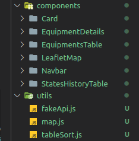

<h1 align="center">Teste Frontend estágio V2</h1>

<h1 align="center">
  
</h1>

<p align="center">
 <a href="#funcionalidades">Funcionalidades</a> • 
 <a href="#feito-com">Feito com</a> • 
 <a href="#desenvolvimento">Desenvolvimento</a> • 
</p>

### Funcionalidades

- [x] Mapa de posição atual dos equipamentos
- [x] Mapa com histórico de movimentações dos equipamentos
- [x] Tabela de histórico de estados dos equipamentos
- [x] Tabela de equipamentos
    - Barra de pesquisa/filtro
    - Botão de ordem por atributos

### Feito com
- [React](https://pt-br.reactjs.org/)
- [React Router DOM](https://www.npmjs.com/package/react-router-dom)
- [Bootstrap](https://getbootstrap.com.br/)
- [Leaflet](https://leafletjs.com/)


### Desenvolvimento

Inicie o desenvolvimento criando os diretórios de assets, components e pages. Após a definição de diretórios, desenvolvi as rotas utilizando o React Router DOM na página App.jsx.

<h1 align="center">
  
</h1>

Optei pelos ```stateless-components``` pela simplicidade para lidar com dados, utilizando ```hooks```, e componentização para reduzir o tamanho dos arquivos e pelo poder de reutilização, assim como o diretório utils que contém funcionalidades dos mapas Leaflet, de ordenação de tabelas, requisições para o arquivo de dados JSON.

<h1 align="center">
  
</h1>

Para a estilização das páginas, defini o index.css para estilos generalistas e módulos para componentes mais específicos.

<h1 align="center">
  
</h1>

<!-- EDITAR E COLOCAR CADA PÁGINA E COMPONENTE DETALHADO E APAGAR RESTO -->
#### Pages
#### ```HomePage```
Renderiza o componente ```Card``` que redireciona para a rota ```/.equipments```
#### ```EquipmentsPage```
```Hooks: useEffect, useState```
```Fake API Fetch: getEquipments, getModels, getStates, getEquipmentsStateHistory, getEquipmentsPositionHistory```
useEffect roda os fetches com o Promise.all e salva todos em um objeto com o useState e muda o display para ```true```, para renderizar na página.
Renderiza os componentes ```EquipmentsTable``` e ```LeafletMap```.
#### ```EquipmentPageDetails```
```Hooks: useLocation, useParams```
Recebe o id do equipamento pelo ```useParams``` e os dados gerais pelo ```useLocation```.
Renderiza os componentes ```BackButton``` e ```EquipmentsDetails```
#### Components
#### ```Navbar```
Renderiza a Navbar com um link para a rota da ```HomePage```.
#### ```BackButton```
```Hook: useNavigate```
```props: to(default: '/')```
Recebe a props ```to``` que deve ser uma rota. 
Contém um ```button``` que fará o redirecionamento de rota.
#### ```Card```
```props: title, description, link, imgUrl```
Renderiza o card como um link que redireciona de acordo com a prop ```link```, as prop ```title, description e imgUrl``` é usada para definir o título, a descrição  e a imagem do card.
#### ```EquipmentDetails```
```Hook: useEffect, useState```
```Fake API Fetch: getStates```
```props: id, equipmentsData```
Recebe as ```props```,```id``` e ```equipmentsData``` para tratar os dados e renderizar-los.
A função ```getActualState``` busca o histórico de estados do equipamento de acordo com o id.
A função ```calculateEarningsAndProd``` calcula os ganhos e a produtividade do equipamento de acordo com os ganhos por hora do modelo e o histórico de estados.
A função ```goToId``` redireciona de acordo com a id de ancoragem da página.
O componente renderiza ```LeafletMap``` e ```StateHistoryTable```

 <h1 align="center">
  
</h1>

#### ```EquipmentsTable```
```Hook: useNavigate```
```props: data, setData, elementsAsc, setElementsAsc```
Usa a props ```data``` para criar as linhas de todos equipamentos, pela função ```createTableRow```, na tabela com o nome, modelo e estado atual.
A função ```handleSort``` ordena a tabela de acordo com o argumento ```orderBy``` e seta os dados ordenados com a prop ```setData``` e o tipo de ordenação, crescente ou decrescente, com o ```setElementAsc```.
A função ```searchInTable``` é ativada pelo filtro de pesquisa da tabela. A cada inserção de caractere ela busca uma linha que contenha a ```string``` pesquisada e muda o ```display``` para ```none``` as que não incluam.

<h1 align="center">
  
</h1>

#### ```StatesHistoryTable```
```props: stateHistory, state```
Renderiza a tabela de histórico do equipamento. Usa as ```props```, ```stateHistory``` e ```state``` pela função ```createTableRow```, que recebe cada elemento do histórico de estados e cria uma linha com a data e o estado do equipamento.

<h1 align="center">
  
</h1>

#### ```LeafletMap```
```Hook: useNavigate```
```props: models, equipments, positionHistory, getAllActual```
Renderiza o mapa de acordo com a prop ```getAllActual```, se for ```true```renderizará a posição atual de todos os equipamentos, se ```false``` renderizará os pontos do histórico de posições do equipamento recebido pela prop ```equipments``` e traçará as rotas entre os pontos.
As funções do mapa são importadas do arquivo ```/utils/map.js```.

<h1 align="center">
  
</h1>