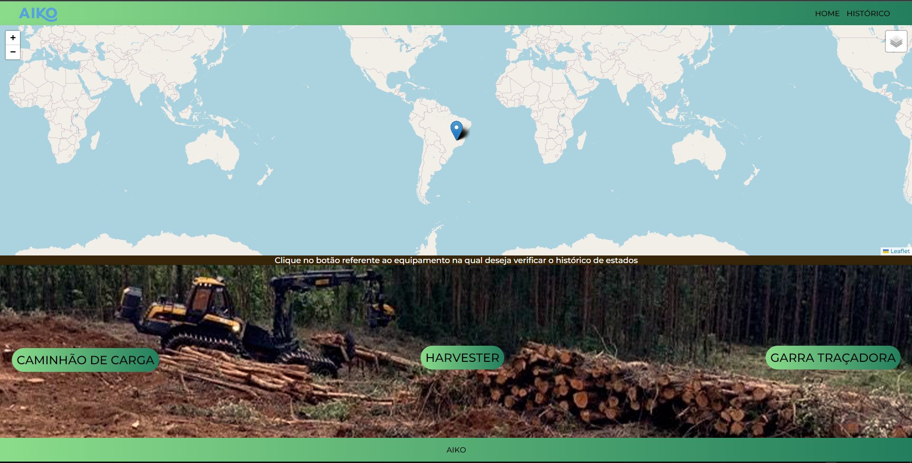

## Dependências necessárias para a execução do projeto em Vue.js
```
npm install
npm i json-server
npm install -g @vue/cli
npm install vue-router@4(responsável pelas rotas do programa) **somente se necessário**
```

### Comandos necessários para a execução do projeto
```
npm run backend(responsável por executar a API feita com json-server)
npm run serve(responsável por compilar e executar o projeto)
```
### Telas do projeto
```
TELA HOME
```
<li>uma barra de navegação criada a partir do componente "NavComponent" </li>
<li>footer importado do componente "FooterComponent" </li>
<li>mapa utilizado atráves da biblioteca "leaflet" para visualização dos ultimos estados dos equipamentos </li>
<li>três botões com redirecionamento aos dados específicos dos equipamentos </li>



```
TELA DE HISTÓRICOS
```
<li>consumo de dados referente ao arquivo JSON "equipmentStateHistory" </li>
<li>todos os dados exibidos dentro de uma tabela </li>


```
MAPA

```
<li>ilustra os equipamentos ao passar o cursor em cima da marcação, e ao clicar exibe o seu último estado </li>


```
### rotas
```
o projeto foi feito com o "vue-router" e conta com 6 rotas, sendo elas: 
<li>Home</li>
<li>/caminhaodecarga </li>
<li>/harvester </li>
<li>/garratracadora </li>
<li>/historico </li>
<li>/:pathMatch(.*)* **para o caso do úsuario tentar acessar uma rota inexistente**</li> 

