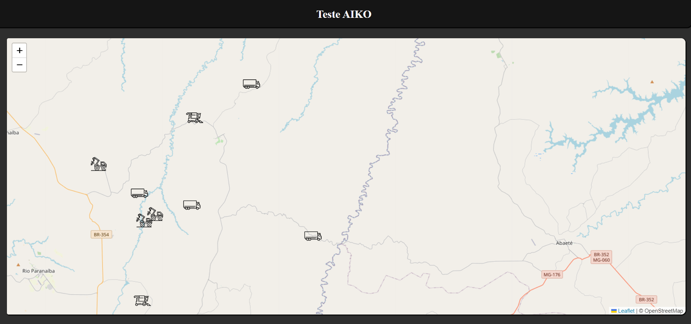

## Tecnologia utilizadas
 Para o desenvolvimento do desafio utilizei das seguintes tecnologias: 
 * HTML: Utilizado para fazer o esqueleto da aplicação
 * CSS: Utilizado para dar estilo a aplicação
 * JavaScript: Utilizado para manipulação de dados e alguns efeitos da pagina
 * Leaflet: Ultizada na criação do mapa

## Requisitos implementados
 *  Posições dos equipamentos: Exibir no mapa os equipamentos nas suas posições mais recentes.
 *  Estado atual do equipamento: Visualizar o estado mais recente dos equipamentos. Exemplo: mostrando no mapa, como um pop-up, mouse hover sobre o equipamento, etc.
 *  Histórico de estados do equipamento: Permitir a visualização do histórico de estados de um equipamento específico ao clicar sobre o equipamento.

## Extras implementados
 * Diferenciar os equipamentos: Diferenciar visualmente os equipamentos por modelo de equipamento na visualização do mapa.
 * Testes: Desenvolva testes que achar necessário para a aplicação, seja testes unitários, testes automatizados, testes de acessibilidade, etc.
 * Documentação: Gerar uma documentação da aplicação. A documentação pode incluir detalhes sobre as decisões tomadas, especificação dos componentes desenvolvidos, instruções de uso dentre outras informações que achar relevantes.
* Mostrar historico de deslocamento no mapa
## Modo de uso
 Para conseguir ver o mapa com os equipamentos na localidade mais recente, basta clicar no mensagem "click para carregar o mapa". A exibição do status, o tipo de equipamento e a identificação dele, basta apertar encima do ponto no mapa. Para visualização do historico do equipamento, basta clicar na opção "exibir historico" localizado debaixo do status do equipamento. Quando estivier visualisando o historico e desejar voltar para o mapa , basca clicar no icone de mapa localizado no canto superio direito. 

 ## Telas/Teste para verificar a visualização
 
 Tela inicial da aplicação

 
 
 Tela do mapa desenhado

 

 Tela mapa mostrando as informações
 

 Tela do historico

 
